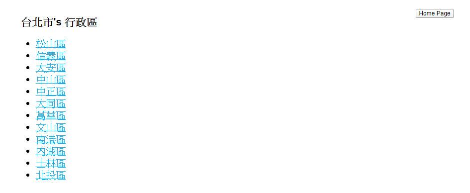
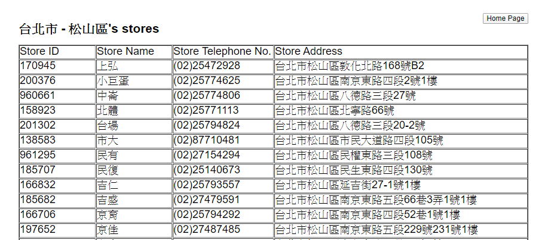

# Seven-Eleven-Crawler
Use Node.js to build API crawling 7-11 stores [link](https://emap.pcsc.com.tw/) information in Taiwan. Demonstrate the functionality by simple html.

## Build Setup
```bash
npm install
```
## Development Environment
* Backend: Node.js  
* Backend-framework: Express  

## Testing
Use [Postman](https://www.postman.com/)

## Function
* Search towns name in one city.
* Search all stores infomation in one town.

## Demo

### (1) Search By **city name** and **town name** -> Direct you to 'Stores Page'
### (2) Search By **city name** -> Direct you to 'Area Page'

### Each link direct you to 'Stores Page'


